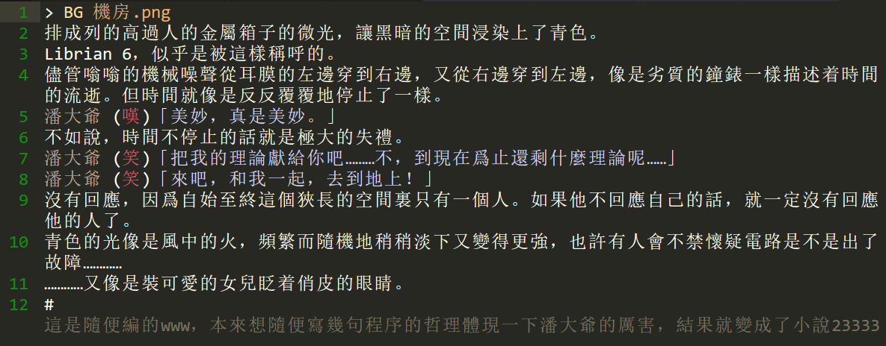

## 關於劇本的寫法 : 

### 劇本格式 : 

其實可以參考樣例劇本大概就明白了。
就是直接寫的一段話就是旁白。
前面帶名字的就是人物對話。

這是在默認情況下的樣例 :

    莆田理工大學是〇〇〇(數據刪除)。
    潘大爺 「歡迎來到莆田理工大學。」

要被識別爲話，方引號和空格都是必須的。在後方引號之後不能有多餘字元。(什麼反人類的設定233333)

名字的變體: 

    傑克|黑衣人 (笑)「咕嘿嘿。」

結果: 人物立繪展現爲傑克，但對話框的名字是【黑衣人】，用於劇情上人名無法得知的場合。此時立繪中傑克的表情是 笑，如果你正確地準備了立繪文件的話，就會使用他的表情 笑。

隱式的: 

    潘大爺 (嘆)

相比之下少了後面的方引號內的內容。   
這不會作爲潘大爺說的一句話來處理，也不需要玩家點擊來跳過，但是會把鏡頭指向潘大爺並改變潘大爺的表情。

如果你想按你自己喜歡的格式書寫也很簡單，你可以簡單修改配置文件來客製化你的格式。(如果你能熟練使用正則表達式……)

關於立繪的自動化，參考下方的「立繪安排」。關於如何準備立繪，參考[立繪](立繪.md)。

文件中的空行總是被忽略，沒有任何影響。   
對話超過一行的得用「\」續行。   
以#開頭的一行爲註釋。   

### 劇本功能 : 

以@開頭的是控制語句。   
它們將會對劇本的演出產生控制作用。

包括 : 
 - *> BG* 背景圖片文件名
 - *> BGM* 背景音樂文件名
 - *> CG* CG的文件名
 - *> T* 切斷圖片的名字
 - *> CL* 人物名 衣着
 - *> VIDEO* 影片的名字
 - *> WRAP* 快速控制選項和跳轉
 - *> py/endpy* (用於插入一段python代碼) 
 - *> js/endjs* (用於插入一段javascript代碼) 

*BG* 會更換當前的BG到你指定的文件   
BG總是在一點時間內漸變的。
可以使用多種圖片格式。
    
    > BG {{文件名}}
    > BG 家裏.png

*BGM* 會替換當前的BGM到你指定的文件。   
如果指定爲None，會有一點淡出時間。但總是沒有淡入。
內核好像只支持ogg格式……

    > BGM {{文件名}} {{音量=1}}
    > BGM 愉快的音樂.ogg
    > BGM 不愉快的音樂.ogg 0.5
    > BGM None

*CG* 進入CG模式並立即使用指定的CG。在這個模式下，CG佔據整個畫面，立繪不會被顯示，背景也是無效的。   
不指定參數會解除CG模式。

    > CG {{文件名=None}}
    > CG 極夜大戰.png
    > CG

*T*使用一張圖片將劇本切斷一小段時間。比如第一章結束，第二章開始的時候就用 @T 二章.png 來插入第二章的標題。   
這個方法一旦被使用，BG呀，BGM呀，立繪呀，都會重置所以要注意。

    > T {{文件名=None}}
    > T 第一章.png

*CL*改變人物衣着。在使用之後，目標人物的立繪衣着持續變成對應的形態。

    > CL {{人物}} {{衣着}}
    > CL 靈夢 巫女服

*VIDEO* 插入一個視頻，用於OP、ED。   
同樣會重置其他信息所以要注意。
內核好像只支持webm格式？

    > VIDEO {{影片名}}
    > VIDEO OP.webm

*WRAP* 設置產生跳轉的選項。在下面的流程控制中講解。   

    > WRAP {{參數1}} {{參數2}} ... 
    > WRAP [接受治療,壞結局.play] [放棄治療,好結局.play]

*py/endpy*（用於插入一段python代碼）   
填在py和endpy之間的python代碼會像真正的python代碼一樣執行，這部分代碼運行在一個獨立的環境裏，所以不能調用外部的函數，也不會產生名衝突。

    > py
    import socket
    s = socket.socket(socket.AF_INET, socket.SOCK_STREAM)
    #這遊戲有毒wwww
    > endpy

*js/endjs*（用於插入一段javascript代碼）   
填在中間的js代碼會像真正的javascript代碼一樣執行，這部分代碼是直接運行在畫面上的，所以可以調用任意的函數，但需要注意名衝突。

    > js
    alert('快交錢才能玩！')
    > endjs

注意: 
+ 命令都是大小寫敏感的。

+ 多餘的空格會被忽略。
    ```
    > BG   河上.png
    >BG 河上.png
    ```
    這兩種寫法都可以。

+ 你的文件名裏含有空格的話，得用引號把它包起來，就像在命令列裏那樣。

### 立繪安排 : 

Librian會自動安排你的立繪，你不需要對每句話指定立繪的位置。

你也可以使用類似這個寫法的「鏡頭」功能來隨心所欲地控制他們。

    + [靈夢, 萃香]

關於更詳細的鏡頭，可參考[立繪](立繪.md)中的鏡頭。

### 流程控制 : 

在py/endpy中，預備了幾個函數供你使用：
```python
    goto(path=None, lable=None)
  
    push(path=None, lable=None)
  
    choice(c1, c2, c3, ...)
```
goto跳轉到另一個路徑爲path劇本（默认是自身）的一個寫作tag的註釋的位置。如果tag不指定就會跳到開頭。   
push的功能是goto加上目標劇本演出結束後回到調用處。   

choice在adv演出中提供幾個選項，每一個選項都是一個list，包括一個選項名和一個回調函數。   
下面是樣例。   
```python
    def f():
        good+=1      #英文真難！
    choice(
        ('跳到一章',lambda: goto('一章.play')),
        ('跳到二章',lambda: goto('二章.play')),
        ('刷好感度', f )
    )
```
每一次執行是互相關聯的，因此你可以使用上次留下的變量進行判斷。   
當然你可以使用python的黑魔法來使用我的其他函數。   
但這些代碼仍是在主線程執行的，對費事的操作也許import threading是個不錯的主意。

WRAP是choice/push的語法糖。

    WRAP [接受治療,壞結局.play] [放棄治療,好結局.play] [動物治療,一章.play,#原點]
    # 話說第三個是什麼鬼……
相當於
```python
choice(
    ('接受治療',lambda: push('壞結局.play')),
    ('放棄治療',lambda: push('好結局.play')),
    ('動物治療',lambda: push('一章.play','#原點'))
)
```

### 語義着色:
「資源」中贈送的sublime語義文件可以幫助你進行語義着色。   
在我這裏，着色後的劇本看起來就像這樣。   

sublime真是太棒了！