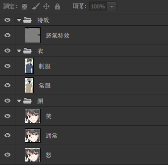
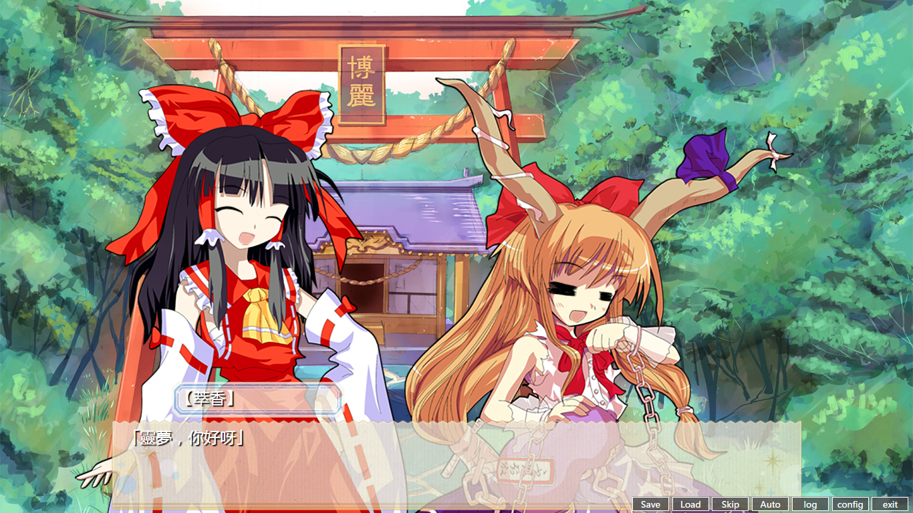

## 關於立繪 : 

還是以一個對話爲例: 

    > CL 潘大爺 制服    
    潘大爺-怒- 「看在上帝的名分上！」
    潘大爺-怒- 「你們這些混帳玩意，早晚我要把你們統統開除！」

<small>(說的什麼鬼)</small>

儘管潘大爺以憤怒的表情說出了這句話，但在你配置立繪文件之前，這句話不會有任何立繪表現。

爲了顯示潘大爺，你得在「立繪」路徑下放置photoshop文件「潘大爺.psd」，才會以圖片作爲立繪。但這個潘大爺只能使用固定的表情和衣着。

爲了使用表情，你得在「立繪/映射.yaml」裏指定你的表情配置文檔。

表情配置文檔的一個示例如下: 
```yaml
    潘大爺:
        衣:
            _默認:
                - 衣/制服
            常服:
                - 衣/常服
        顏: 
            _默認:
                - 顏/通常
            笑:
                - 顏/笑
            怒:
                - 顏/怒
                - 特效/怒氣特效
```
項中的路徑是你在ps文件裏的圖層組路徑。   
「潘大爺.psd」看起來應該像這樣:    
   
(說明用，圖層是隨便畫的)

如果你正確配置了它，那麼之前的對話中會將
【衣】-> 「潘大爺.psd」中 **「衣」圖層組的「制服」圖層**  
和
【顏】-> 「潘大爺.psd」中
        **「顏」圖層組的「怒」圖層** ，
        **「特效」圖層組的「怒氣特效」** 疊加。

疊加位置是總是保持psd文件中圖層原本的位置。

## 關於鏡頭 :

鏡頭可以簡便地管理和顯示和立繪。

    + {潘大爺:[100,100,1.5]}

這就確定了一個鏡頭，在下次定下潘大爺鏡頭之前，潘大爺的立繪就固定在窗口上距離左上角(100,100)處出現，并且变成原本的1.5倍大小。   
第三个参数可以省略，这样就是保持原本大小。

    + {潘大爺:[100,100],林梓雨:[500,100]}

這是一個「多人鏡頭」，不僅確定了潘大爺和林梓雨的位置，而且綁定了兩人。當其中一人在對話中出現時，另一人也會隨之出現。 

    + [潘大爺, 林梓雨]

這是簡化的寫法。   
同樣是雙人鏡頭，這會直接把潘大爺和林梓雨放在他們的默認位置上。在項目設置中設定「默認位置」。

像是這樣的效果: 

(我上哪去找林梓雨……姑且用可愛的女孩子湊個數吧)

    - 潘大爺
    
這會解除鏡頭綁定，出現潘大爺時不使用鏡頭，用於某些特殊場景(比如潘大爺躲在衣櫃裏 <small>(笑)</small>)。

注意: 

1. 在邏輯上，畫面出現的是一個完整的鏡頭，而不是人的立繪。所有人物有一個關聯鏡頭，新鏡頭關聯時舊關聯會解除。所有人物都有一個僅包含自身的默認鏡頭。

2. 鏡頭的綁定是單向的，对绑定的其中一人绑定新镜头，原本的镜头不会被破坏。看這個例子: 
    ```
    + [潘大爺, 林梓雨]
    - 潘大爺
    ```
    這個寫法會讓潘大爺在說話的時候不出現立繪，而林梓雨說話時出現潘大爺和林梓雨。   
    如果你想表達的意思是「潘大爺和林梓雨說話->潘大爺走了->林梓雨自言自語」應該寫成:
    ```
    + [潘大爺, 林梓雨]
    #對話對話對話
    + [林梓雨]
    #自言自語自言自語
    ```